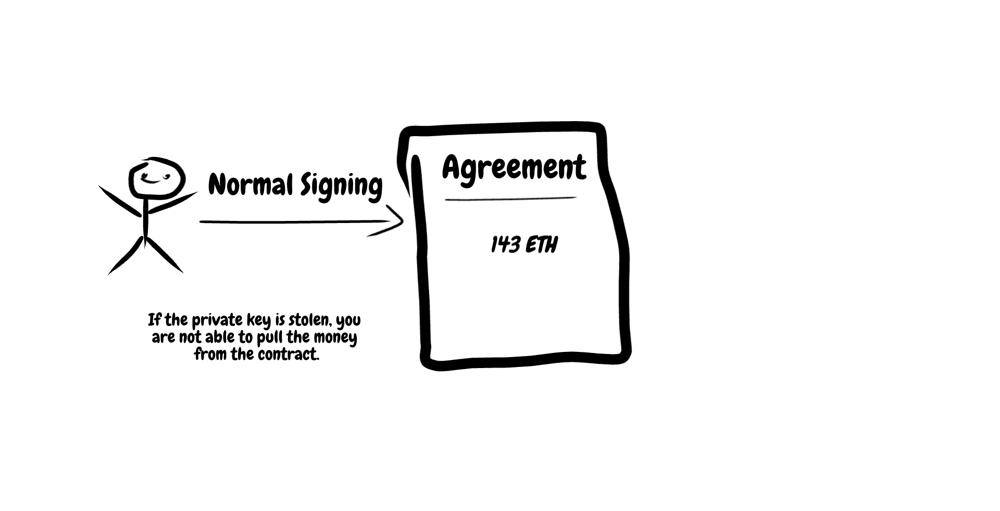

# proxied-address

> An approach to fix the loss of private key problem.

## Table of Contents

- [Security](#security)
- [Background](#background)
- [Install](#install)
- [Usage](#usage)
- [API](#api)
- [Maintainers](#maintainers)
- [Contribute](#contribute)
- [License](#license)

## Security
**This is currently alpha quality** use it at you own risk.

## Background
When using ethereum and the blockchain at all you often use a private key to access your account. 
In the case you lose your private key you lose your funds as well (and maybe the access to contract's in the case of ethereum).
Ethereum is a smart contract platform.
So let's say you marry your partner and you both have the contract on the blockchain. 
In case you lose your private key you can't prove that you married your partner since you don't have access to the private key anymore.
Or even more worst, someone can use your stolen private key to send a "divorce" transaction which which could trigger some other unwanted "events".
This repo contain's an approach on how to address this issue by delegating the "owning" of such contract's to a "proxyAddress" (technically another contract).
Here are some graphics for better understanding.

__Normal way__
> This is the normal way. Your lose your private key = you lose access to the smart contract.

__Proxy Address Way__
> This way you are NOT the owner of the agreement.
> The agreement is owned by a proxy between you and the agreement.
> BUT you have access to that proxy and can control it.
> In case your daily use account (maybe your mobile phone) get's stolen, you can replace that address that can access the agreement with your admin address.

## Install
Deploy the contract `contracts/AddressProxy.sol` with the tool you prefere (e.g. remix and metamask). 

## Usage
You first need to deploy the `contracts/AddressProxy.sol`. 
The first address should be the address of the private key you use in your daily live.
The second address should be as secure as possible (maybe a ledger?). You will always never need it (except to replace the current owner and the recovery address)

You are now ready to use the proxy address. 
For every state mutate interaction with smart contract's you need to get the [transaction data](https://github.com/ethereum/wiki/wiki/JavaScript-API#contract-methods) by calling the `getData` method on web3 contract instance.
After you go the data, you just call the `exec` method of the address proxy with the address of the smart contract you want to interact with, and the data you got from the `getData` method. 
All transaction's executed with the proxy contract are owned by the contract. Access to a contract can be changed without changing the address in the target contract.

## API
Please have a look at `contracts/AddressProxy.sol` in order to figure out how to interact with this contract.

## Maintainers

[@florianlenz](https://github.com/florianlenz)

## Contribute

See [the contribute file](contribute.md)!

PRs accepted.

Small note: If editing the README, please conform to the [standard-readme](https://github.com/RichardLitt/standard-readme) specification.

## License

MIT © 2018 Florian Lenz
